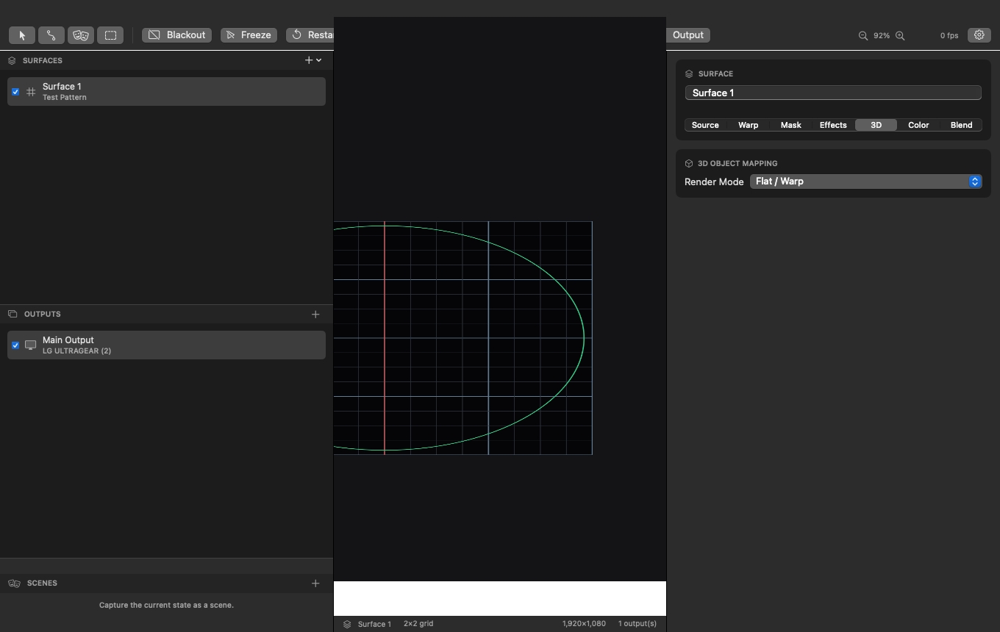
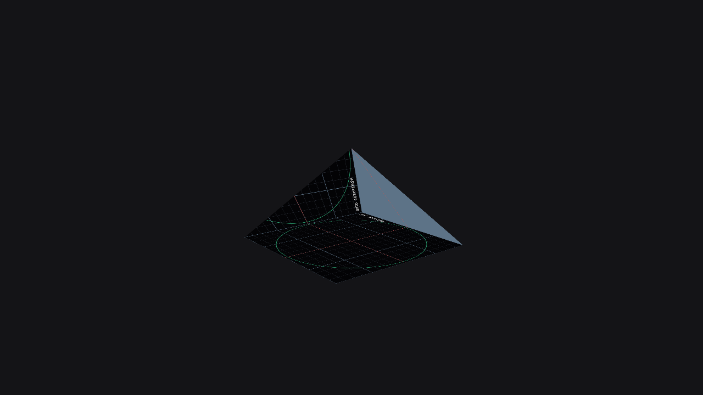
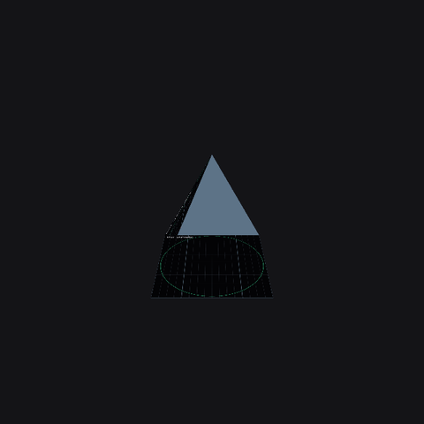

# 3D Mapping

Mapping content onto physical 3D objects (boxes, sculptures, facades) instead of flat surfaces.



## How it works

A 3D-mapping surface imports a mesh, textures it from any source, renders it from a **virtual
projector camera**, and then feeds the result through the normal warp/mask/effects/blend stack.
This reproduces how a real projector paints an object: the content is projected from the
projector's point of view onto the geometry.



## Model import

Meshes load through **ModelIO**, so these formats work without extra dependencies:

- **OBJ** (fast hand-rolled parser as fallback)
- **PLY**
- **STL**
- **USD / USDZ**

Choose a file in the surface's **3D** tab. The mesh is normalized to a unit cube at the origin.

## Virtual projector camera

Dial in the camera that stands in for your real projector:

- **Azimuth** / **Elevation** — orbit around the object
- **Distance** — how far the projector is
- **FOV** — projection field of view
- **Lighting** — how much of the shape is revealed by surface shading (0 = flat texture, 1 = full
  Lambert)



## Real projector pose (PnP)

For accurate object mapping you ultimately want the **real** projector's pose, not a hand-dialled
one. Prism includes a **DLT PnP (resection)** solver: given 6+ correspondences between known model
points and observed 2D points, it solves the 3×4 projection matrix and recovers the camera centre.

```text
reprojection error ≈ 0.00 px, camera centre exact  (synthetic self-test)
```

The solver is implemented and unit-tested; wiring it to an automatic feature-matching workflow
(project features onto the object, detect them, correspond to model vertices) is the next step.
Today you can supply correspondences yourself or dial the virtual camera.

!!! note "Occlusion & per-face mapping"
    The current renderer draws the whole mesh from the projector camera. **Per-face projective
    texturing** (UVs derived from the true projector frustum) and occlusion masking against the
    real object are future work.
