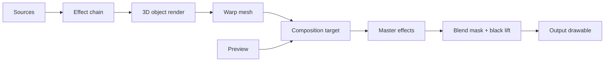

# Architecture

Prism is Swift + Metal with a small number of optional native shims. No Electron, no runtime
interpreter in the hot path.

## Module map

```text
Sources/Prism/
  App/         app delegate, menus, self-test, sample project, docs export
  Model/       Codable project model (canvas, outputs, surfaces, scenes, mappings, timeline)
  Render/      Metal context + pipelines, runtime shaders, mesh builder, masks,
               render engine, overlay builder, 3D loader/pipeline
  Sources/     texture providers: solid, test pattern, image, video, camera,
               screen capture, Syphon, NDI, DeckLink, browser, plus the source manager
  Audio/       per-device audio routing engine, CoreAudio device enumeration,
               FFT/beat audio input analyzer
  Timeline/    timeline playback engine and per-surface overrides
  Timecode/    LTC codec, MTC send/receive, timecode-follow service
  Calibration/ Gray-code structured light, correspondence decode, mesh/dome solve,
               blend masks, dot detector, homography + PnP solvers
  Record/      AVAssetWriter program recorder + audio muxing mixer
  UI/          SwiftUI shell, sidebar, inspector, effects/modulator editors,
               canvas view, timeline view, output windows, app state
  Control/     UDP socket, OSC codec, MIDI input, Art-Net, parameter router/resolver
  Persistence/ project JSON I/O, sample project
  Util/        geometry (homography, transforms), polygon triangulation
```

Optional native targets: `CSyphonShim`, `CFFmpeg`, `CDeckLink`, `CNDI`.

## Frame pipeline



Per surface: source → optional effect chain → optional 3D render → warp draw (mask + color +
blend mode) into the composition render target. Then master effects, then per-output blend
mask/black-lift/guides, then the drawable. Preview renders the same composition.

## Threading

Rendering runs on the **main thread** (MTKView display links), so the document model can be read
and edited **lock-free**. Geometry caches self-invalidate by comparing grid/transform/mask values.
Audio input analysis runs on a realtime tap thread and publishes a lock-protected snapshot.
Decoding (video/audio/OBJ) happens on background queues and hands results back to main.

## Live values

Modulators and the timeline don't mutate the published project each frame. Instead they produce a
non-published live-value set and per-surface overrides, which are folded into an
`effectiveProject()` snapshot for rendering. This avoids SwiftUI churn and keeps undo clean.

## Verification

Two layers of automated verification:

- **`PRISM_SELFTEST=1`** runs headless and exercises the whole stack — shader compilation, every
  pipeline, mesh/mask math, pixel readback, effects, structured-light decode, mesh solve, blend
  normalization, PnP/DLT, LTC, parameter resolution, and recording — so the math-heavy subsystems
  are covered without hardware.
- **`PRISM_DRIVE_TEST=1`** drives the real UI through the Accessibility API and verifies each
  control against live state, plus reads back the actual `renderOutput` pass to confirm per-output
  settings (edge blend, color, guides, test-pattern override, HDR) really change the output pixels.

The one thing automated tests can't do is confirm the physical projector: the final WindowServer
composite onto a display requires eyes on the hardware.
