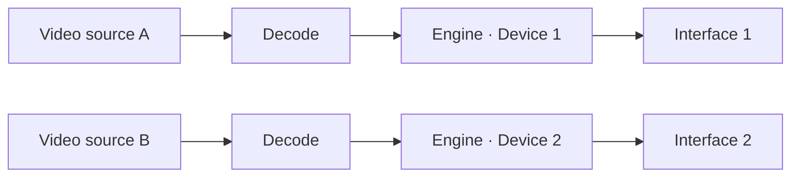

# Audio

Audio in Prism is a first-class subsystem, not an afterthought. The community's **#1 recurring
complaint** across Resolume/MadMapper is per-device routing — Prism solves it directly on
CoreAudio.

## Per-device routing

The **AudioEngine** maintains one `AVAudioEngine` graph **per output device**. Each video source's
audio is decoded to PCM (48 kHz stereo) and played through an `AVAudioPlayerNode` into the graph
for its assigned device:



In the source's **Audio Routing** panel, pick an output device (or System Default). When a device
is assigned, the `AVPlayer` video path is muted so audio isn't doubled. Per source you get
**volume**, **mute**, **loop**, and **restart**; there is a master audio volume too.

`AVAudioEngine`'s output device is set via `kAudioOutputUnitProperty_CurrentDevice` on the output
audio unit, so each graph targets its own interface. Multi-channel interfaces work as-is;
multi-channel **routing** (surround, per-channel) is a next step.

## Live audio input

Enable **Capture Audio Input** in project settings and pick an input device. An `AVAudioEngine`
tap feeds an **Accelerate/vDSP FFT**, producing:

- **level**, **bass** (20–250 Hz), **mid** (250 Hz–2 kHz), **treble** (2–12 kHz) bands
- an energy-based **beat** pulse with decay

<small>Capture requires microphone/screen-recording permission and shows the system recording
indicator.</small>

## Modulation

The measured bands (plus LFOs, smooth random, and the beat pulse) drive the **modulator** system.
A modulator targets any parameter by its dotted path and maps its raw 0–1 value into a range:

| Modulator | Use |
| --- | --- |
| Sine / Triangle / Saw / Square LFO | rhythmic movement (opacity, scale, rotation) |
| Random (smooth) | subtle variation |
| Audio Bass / Mid / Treble / Level | react to the spectrum |
| Beat Pulse | punchy per-beat hits |

```text
target: surface.1.transform.scale.x   min 0.9  max 1.15   (audio bass)
```

Modulation is applied live without polluting the undo stack, and without churning the UI
(synthesized into the render snapshot each frame).

## Recording audio

Recordings include a **muxed audio track**: a dedicated mixer mirrors the project's audio sources,
sums them, and feeds LPCM sample buffers to an AAC `AVAssetWriter` input alongside the video. See
**[User Guide → Recording](user-guide.md#recording)**.
