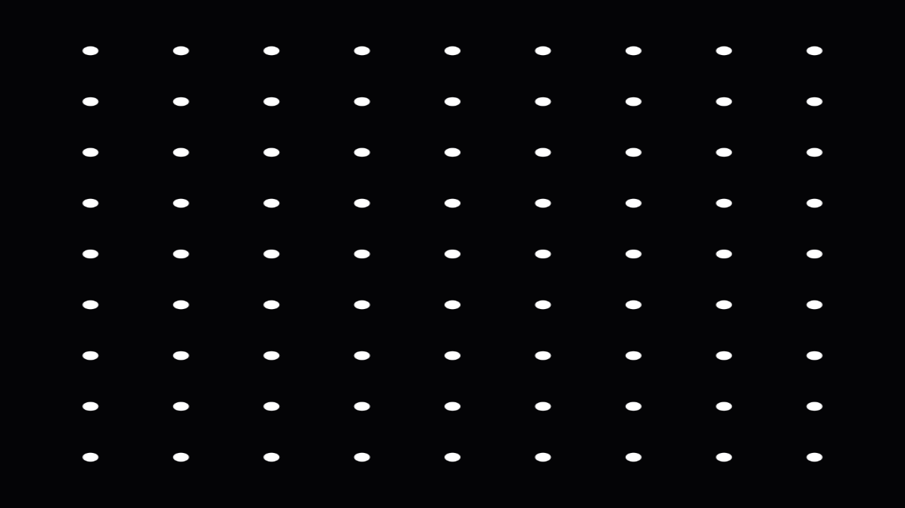
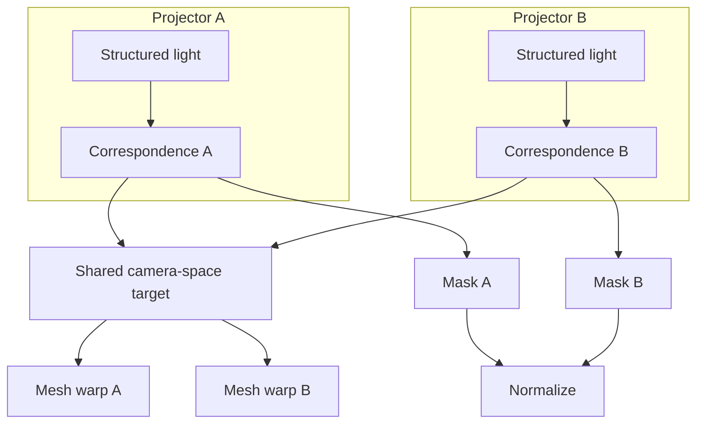

# Auto-Calibration

Prism calibrates a projector by **observing** what it projects. A camera (any camera, screen
capture, or SDI input source) sees the projection; Prism decodes where each camera pixel was lit
and solves the warp that makes content land correctly on the physical surface. The same machinery
handles planes, curved surfaces, and domes, and aligns multiple projectors to each other.

## Two solvers

### 1. Dot-grid homography (quick, planar)

Project a grid of dots, detect the blobs in a camera frame, solve a least-squares
**DLT homography** from projector to camera, then set the surface corner-pin so content rectifies
onto the detected region. Best for a single flat surface. Buttons: **Project Dots** →
**Capture & Solve**.

### 2. Structured light (planes, curves, domes, multi-projector)

This is the general solver.

- **Gray-code patterns** are emitted by the output shader at exact projector-pixel resolution, so
  every camera pixel decodes to the projector pixel that lit it — a **dense correspondence map**.
  White/black references give a per-pixel threshold for robust 0/1 recovery.
- Because there is no planar assumption, the correspondence can bake **any** surface geometry:
  flat walls, curved screens, domes.
- `MeshSolve` maps the correspondence through a **shared camera-space target** into an arbitrary
  resolution Catmull-Rom **warp grid**.

## Multi-projector alignment

Each projector is calibrated independently, but all are solved to the **same camera-space
target** (the intersection of their illuminated footprints). Because every projector draws the
same content onto the same physical region, images line up across seams automatically.

### Blend masks

For each projector, Prism computes a **coverage weight** over the content (feathered at the edge
of the illuminated footprint), rasterizes it into projector space, and **normalizes** the masks so
overlapping pixels sum to 1 across projectors. The output pass multiplies by the mask. Masks are
saved as PNGs and referenced by the output so they persist with the project.

### Photometric black-level matching

Projectors leak different amounts of black. Prism captures each projector's black frame, measures
the mean level, and applies a per-output **black lift** so blacks match in the overlap (the fix for
the classic 3LCD "grey box").

### Running it

1. Add a **Camera** (or Screen Capture / SDI) source to use as the calibration camera.
2. Assign each projector's surface to exactly one output (so each output has a warp target).
3. In the surface's **Auto-Calibration** panel, pick the camera and click **Auto-Calibrate All
   Projectors**.

Prism runs the full structured-light sequence for every output, applies mesh warps, writes blend
masks, and matches black levels. Status is shown live.

## Recommended workflow on real hardware

1. Mount the camera so it sees the whole surface. Keep it fixed for all projectors.
2. Calibrate, then project an alignment grid and fine-tune if needed.
3. Re-run black-level matching after ambient light changes.

!!! warning "Not yet hardware-verified"
    The solvers are unit-tested against synthetic correspondences (structured-light decode, mesh
    solve, blend normalization, PnP all pass), but the full camera→projector path has not been
    exercised against real projectors and cameras. Expect to want camera **intrinsics/lens
    distortion** calibration and a nonlinear **bundle refinement** pass for production polish.
