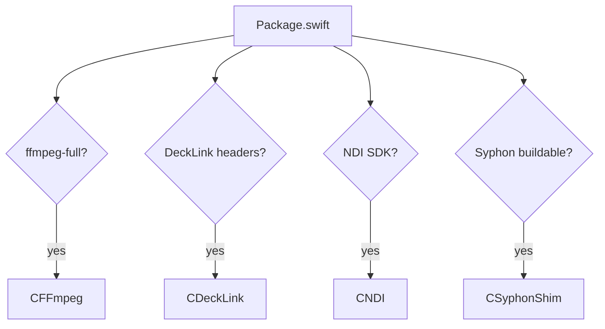

# I/O & Codecs

Prism integrates with the professional I/O you already own, and everything optional is
**auto-detected at build time** and degrades gracefully.

## Sources

| Source | Backend | Notes |
| --- | --- | --- |
| Video files | AVFoundation / VideoToolbox | ProRes, DNxHR, H.264, HEVC natively |
| HAP / HAP Alpha / HAP Q / NotchLC / DXV | optional FFmpeg | auto-routed when the codec isn't native |
| Images | AVFoundation | PNG/JPEG/HEIC/… |
| Camera / capture device | AVFoundation | |
| Screen capture | ScreenCaptureKit | captures any display |
| Syphon | Syphon.framework | same-machine texture sharing |
| NDI | NDI SDK | network video with discovery |
| SDI / HDMI | Blackmagic DeckLink | capture from SDI/HDMI |
| Web page | WKWebView | snapshot source for dashboards/HTML |

Codecs are chosen automatically: `CodecSupport` inspects the AVFoundation format description and
routes HAP/DXV/NotchLC/unknown codecs to FFmpeg, keeping ProRes/H.264/HEVC on the fast native
VideoToolbox path.

## Outputs

- **Displays** — full-screen output windows on any HDMI/Thunderbolt/DisplayPort display.
- **NDI** — publish the whole composition as an NDI source (name, resolution, fps).
- **Syphon** — publish the composition as a Syphon server.
- **SDI / HDMI** — send the composition out a DeckLink device.
- **HDR / 10-bit** — per-output extended-range `rgba16Float` + EDR.

## How detection works

`Package.swift` probes the machine and only includes the targets it can build:

Syphon is pulled at runtime via an Objective-C shim (no hard compile-time dependency). The app
bundle embeds `Syphon.framework` and `libndi.dylib`.

## Setup notes

- **Syphon** — built and embedded automatically by `scripts/build_app.sh` when the Metal toolchain
  is present.
- **DeckLink** — install Blackmagic Desktop Video, then drop the DeckLink SDK's Mac include files
  into `vendor/decklink/`. The `CDeckLink` target then compiles in.
- **NDI** — install the NDI SDK for Apple; on macOS 15+ grant **Local Network** permission. If NDI
  seems to prefer Wi-Fi over Ethernet, disable Wi-Fi as NDI recommends.
- **Camera / screen** — macOS will prompt for Camera and Screen Recording permission on first use.

!!! warning "Hardware validation"
    NDI and DeckLink are wired in and detected, but were integrated without connected hardware, so
    only API availability and enumeration are covered by the self-test. Validate on real devices.
