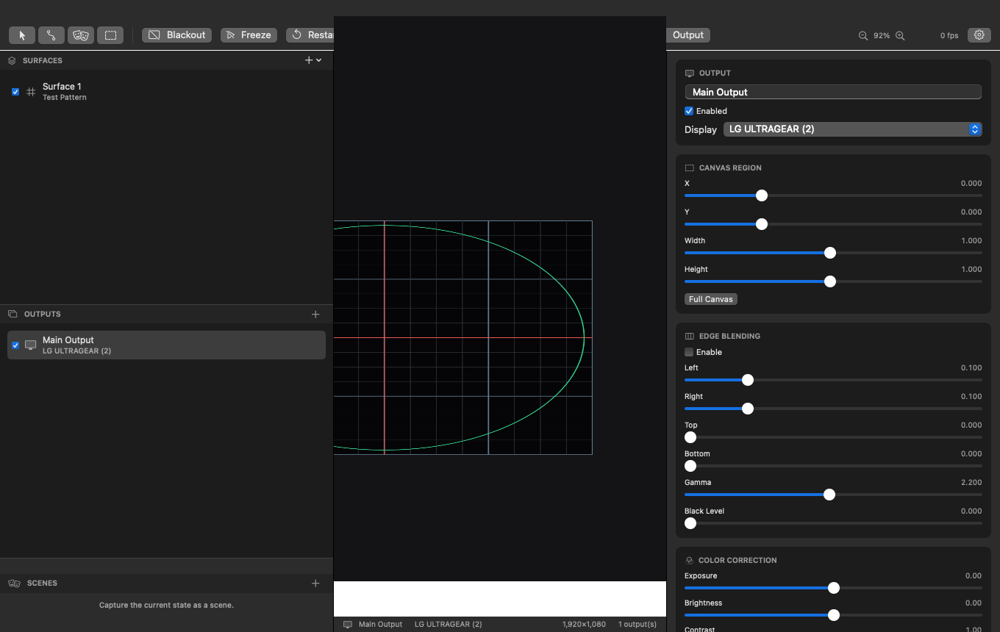
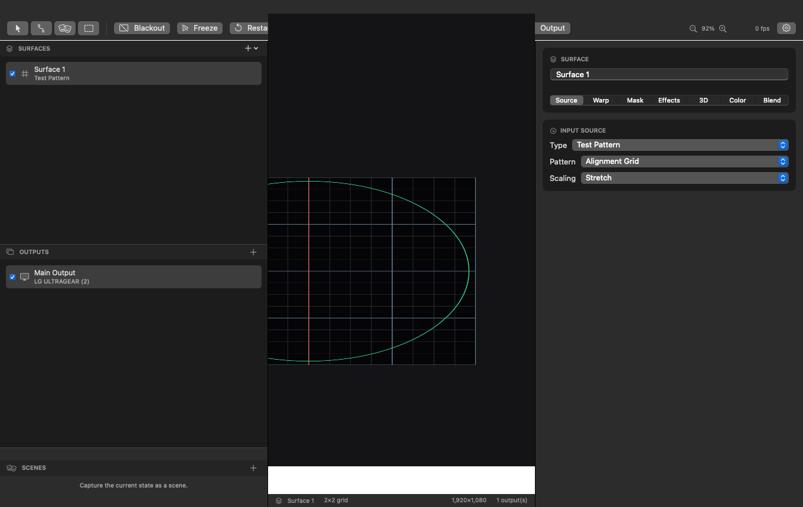
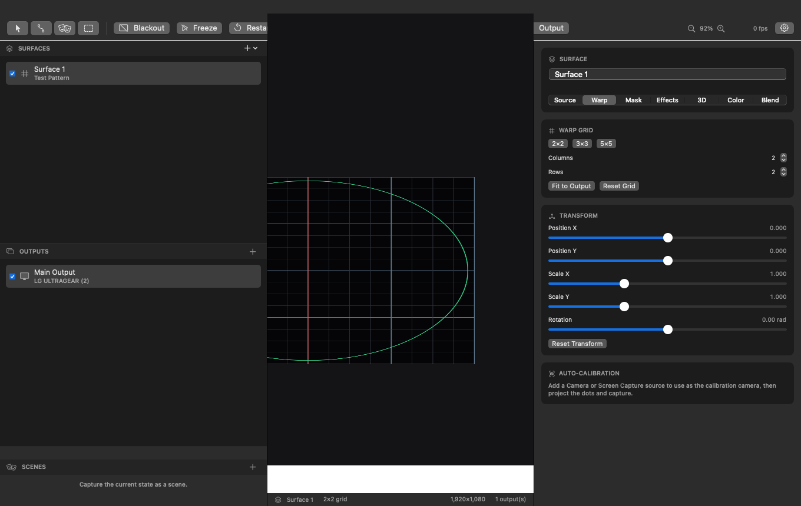
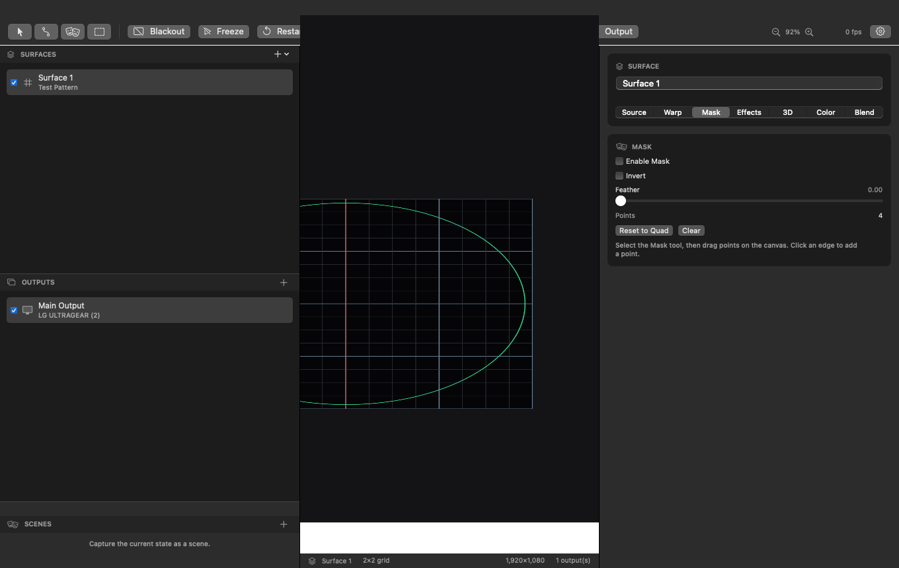
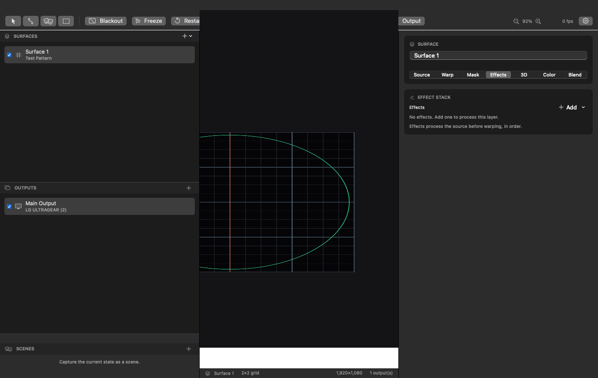
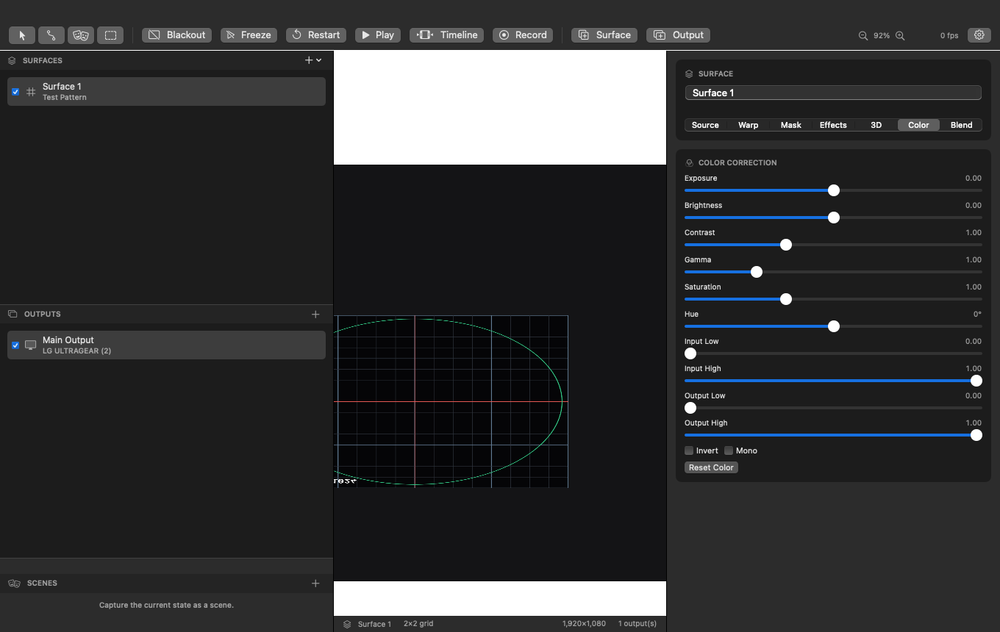
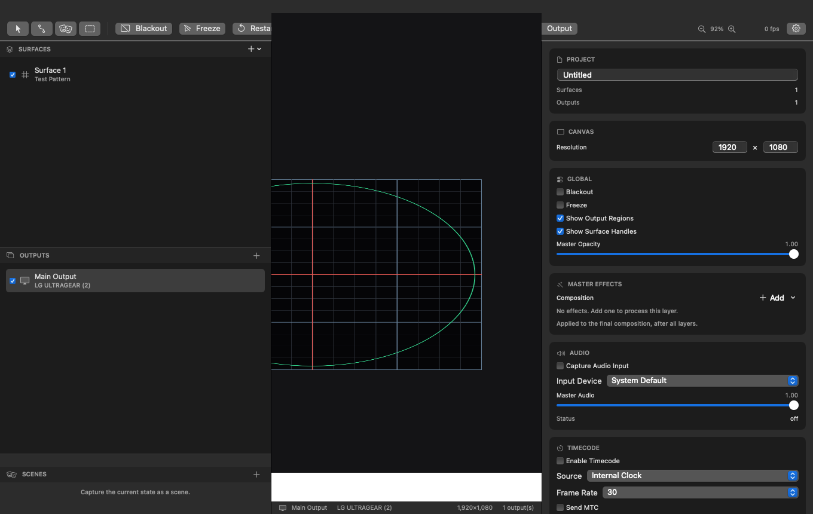

# User Guide

The editor has four areas: the **Surfaces/Outputs/Scenes** sidebar (left), the **canvas** (center),
the **inspector** (right), and the **toolbar/status bar**. The gear button (top right) opens
project, network, and calibration settings.

## Outputs & canvas

An **Output** is a full-screen window on one physical display (HDMI/Thunderbolt/DisplayPort). All
surfaces live on a shared normalized **virtual canvas**; each output shows a configurable
sub-region of it, so two projectors can cover the left and right halves of one big image.

Per output you can set:

- **Canvas region** — the sub-rectangle of the canvas this projector shows.
- **Edge blending** — independent left/right/top/bottom widths, gamma, and black-level lift.
- **Color correction** and orientation **flips**.
- **Test patterns** and calibration **guides** (grid, crosshair, safe area, label).
- **SDI/DeckLink output device** and **HDR / 10-bit** output.

Assign outputs to displays in the Outputs sidebar or the output inspector. Windows are hot-plug
aware and re-sync when displays change.

## Surfaces

A **Surface** is a layer: a source, a warp, a mask, effects, color, and blending. Surfaces are
drawn onto the canvas in order.

### Sources

- **Solid color** and **test patterns** (grid, focus grid, checkerboard, SMPTE color bars, dot
  grid, concentric circles, gradient, crosshair, calibration dots).
- **Image** and **video** files (with audio, looping, rate, volume).
- **Camera** capture devices.
- **Screen capture** of any display (ScreenCaptureKit).
- **Syphon**, **NDI**, **SDI/DeckLink** live inputs.
- **Web page** (WKWebView snapshot) for dashboards and HTML graphics.
- Fill modes: **stretch**, **fit** (letterboxed), **fill** (cropped).

### Warping

- **2×2 grid** = true projective **corner-pin** (drag the four corners).
- **Larger grids** (up to 16×16) = **mesh warp** interpolated bicubically (Catmull-Rom) for curved
  surfaces.
- **Transform** panel for numeric position/scale/rotation, plus reset/fit controls.
- **Auto-Calibration** panel — see **[Auto-Calibration](calibration.md)**.

Use the **Warp Points** tool to drag control points on the canvas; use the **Select** tool to move
a whole surface.

### Masks

Polygon masks with **feather** and **invert**. Select the **Mask** tool and drag points on the
canvas; click an edge to insert a point.

### Effects

A per-layer effect stack plus a **master** (composition) chain, applied in order on the GPU:

`blur · bloom · glow · pixelate · RGB split · chroma key · luma key · kaleidoscope · displacement ·
posterize · scanlines · sharpen · edge detect · vignette · mirror · invert · threshold · colorize ·
feedback · hue shift`

Each has a **mix** amount and named parameters.

### Color & blend

Per-surface color correction (exposure, brightness, contrast, gamma, saturation, hue, levels,
invert, monochrome), opacity, blend modes (Normal/Add/Multiply/Screen/Lighten/Darken), and output
targeting.

## Timeline & scenes

The multi-track timeline supports clips with drag/resize, fade in/out, per-track mute/solo, loop
points, and scrub/play transport. Open it from the toolbar. **Scenes** capture and recall surface
visibility/opacity and output blackout.

## Recording

The **Record** button captures the program composition to an H.264 `.mov` via `AVAssetWriter`,
including a muxed **audio track** summed from the project's audio sources. The render happens on
the GPU; frames are read back through an IOSurface pixel buffer.

## Project settings

The gear button opens global settings: canvas resolution, master opacity, blackout/freeze,
master effects, audio input, modulators, timecode, Syphon/NDI output, OSC/MIDI/Art-Net, and
control mappings. Projects save as human-readable JSON (`.prism`) with autosave and recovery.
